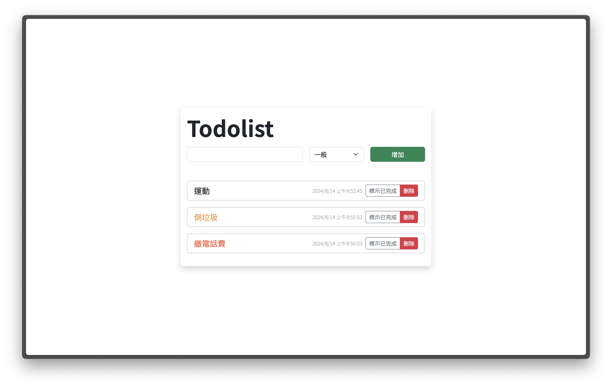

# Vue Todolist

A simple web-based TodoList application built with Vue.js, featuring task prioritization, automatic timestamps, and efficient task management.

## Features

- Add and delete tasks
- Mark tasks as complete
- Prioritize tasks with status options: "Normal", "Important", and "Urgent"
- Automatic timestamp for task creation and updates
- Local storage to persist tasks
- Clean and intuitive user interface
- Responsive design for desktop and mobile devices

## Preview

- Desktop
  

- Mobile
  

## Live Demo

[Try Todolist](https://yuch3nchen.github.io/vue2-cli-todolist/)

## Technology Stack

- Vue.js 2
- BootStrap 5
- SCSS

## Getting Started

To run this project locally:

1. Clone the repository

```
git clone https://github.com/yuch3nchen/vue2-cli-todolist.git
```

2. Navigate to the project directory

```
cd vue2-cli-todolist
```

3. Install dependencies

```
npm install
```

4. Start the development server

```
npm run serve
```

5. Open your browser and visit `http://localhost:8080`

## Building for Production

To build the app for production, run:

```
npm run build
```

The built files will be in the `dist` directory.

## Contributing

Contributions are welcome! Please feel free to submit a Pull Request.

## License

This project is open source and available under the [MIT License](LICENSE).

## Contact

If you have any questions or suggestions, please feel free to contact me:

- Email: yuch3nchen@gmail.com
- GitHub: [@yuch3nchen](https://github.com/yuch3nchen)

### Customize configuration

See [Configuration Reference](https://cli.vuejs.org/config/).
